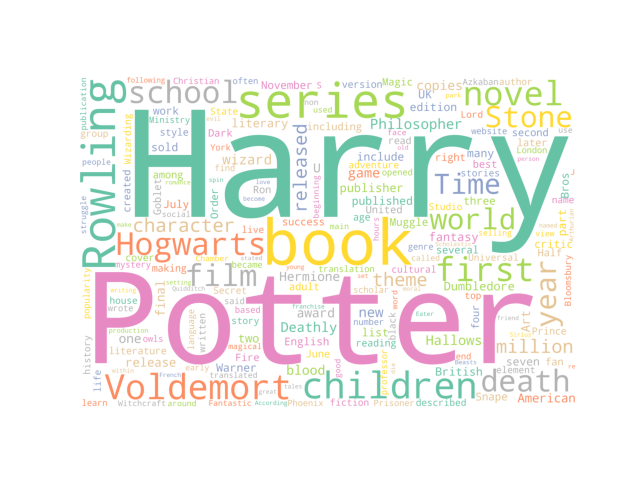

# Text Analysis of Harry Potter Wikipedia Page

## Project Overview

I thought it would be better to talk about my favorite book rather than about a book I don't know, so I analyzed using Harry Potter's Wikipedia page. I used wikipediaapi to fetch Wikipedia pages and used nltk for natural language processing. The most frequent words were printed or the 10 most frequent words were printed. And since I've done a lot of outputting simple results so far, I wanted to make a visual material like a graph. So, in this project, I tried to create various visual materials such as graphs and world clouds.

---
## Implementation

Before writing the text analysis code, I first organized the text to make it easier to analyze. Elements that interfere with analysis such as special characters and capital letters have been removed. The data structure of the text was changed in order to organize the parts of speech by using the list, tokenize the words to create a list, and to output only the desired values. And by creating visual data, the output data, such as frequency, was made easy to understand.

I chose the factory pattern as my design pattern. Because the code became long and complicated, I divided object creation and class implementation to reduce interdependence, and set the already generated code to be reusable. And I set the code to return the desired value by changing the Wikipedia page or the word I want to search for frequency. I also made it possible to add new classes to the factory without having to modify the code.

---
## Results

This is a word frequency graph I made. As expected, there were a lot of stopwords, and since it is Harry Potter's Wikipedia, you can see that the use of the word Harry Potter is high. Until now, there were times when it was difficult to see the usage rate of words because I had written only the code that came out in the list. By making this visual data, I was able to compare desired data such as word frequency at once.

This is a word cloud created by word frequency count. It's a Wikipedia page about Harry Potter, so it's not surprising that there are a lot of Harry Potter words. However, it was interesting that Voldemort appeared noticeably more than the names of Hermione or Ron, the other protagonists of Harry Potter. Looking at other words, their names did not appear. They also reported similarity results to their Wikipedia page, but they were too low to be included in the results. This word cloud shows the frequency ratio of words at once, so it seems effective when analyzing text with Python. The picture above is a custom made by me, but it seems to show it well in design.

---
## Reflection

From a process point of view, what I was satisfied with was natural language processing using **nltk**, such as tokenization. Using **nltk**, I was able to classify into more detailed categories, such as classifying parts-of-speech rather than segmentation of words that I used to do in the data structure class. I think the scope of the project is reasonable. However, I selected a limited topic from Wikipedia rather than Gutenberg's book, and it was difficult to create a text cluster mds compared to other objects in the later part of the project. There are no other famous works by comparable authors and for some reason partial_ratio didn't work, making it impossible to configure mds. If I had checked the text comparison items and thought well before starting this task, I think the test plan would have been more effective. One of the most interesting and enjoyable things to learn in this assignment is visual material production. Creating a graph or cloud was more fun than giving an answer using code.

To recap, one thing I think I'm better at with this assignment is crawling and analyzing data from the web. I think I was able to improve my coding skills by trying various things such as finding specific words and making graphs, not just the frequency. 